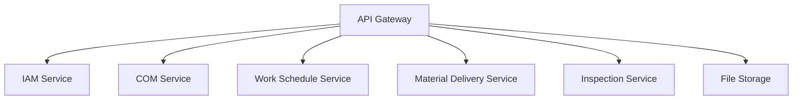
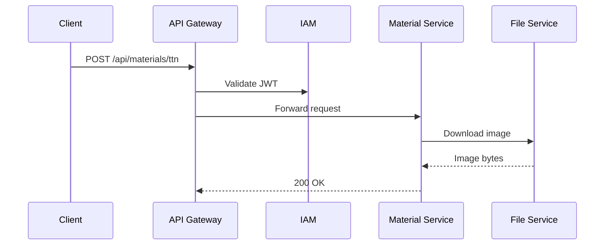
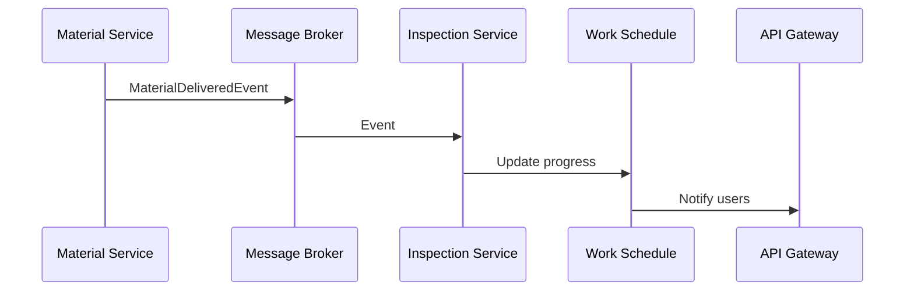
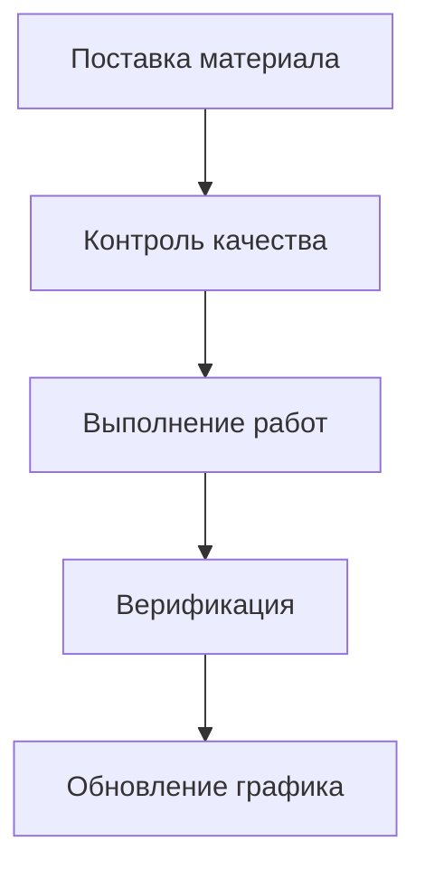
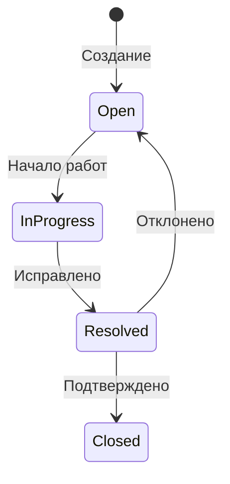

# Архитектурная документация системы управления строительными объектами и поставками

## 1. Обзор системы
Гибридная микросервисная архитектура с сочетанием синхронных (REST) и асинхронных (Event-Driven) взаимодействий. Основные компоненты:



## 2. Сервисы системы

### 2.1 API Gateway (Go)
**Назначение**: 
- Единая точка входа для всех клиентов
- Маршрутизация запросов
- Валидация JWT-токенов
- Агрегация ответов

**Технологии**:
- Go 1.21+
- Gin/Fiber фреймворк
- JWT валидация

**Пример маршрута**:
```go
// Обработка запросов к Construction Service
authGroup.POST("/objects", func(w http.ResponseWriter, r *http.Request) {
    ForwardRequest(w, r, "http://construction-service:8080/api")
})
```

### 2.2 IAM Service (C#)
**Назначение**:
- Управление пользователями и ролями
- Аутентификация (JWT)
- Авторизация действий

**Технологии**:
- .NET 8
- Entity Framework Core
- PostgreSQL
- JWT

**Пример API**:
```csharp
// POST api/register
[HttpPost("Register")]
[AllowAnonymous]
public async Task<ActionResult<LoginResponseDto>> Register([FromBody] RegisterRequestDto request)
{
    return await _authService.RegisterUser(request);
}
```

### 2.3 COM Service (C#)
**Назначение**:
- CRUD операции с объектами
- Хранение полигонов (PostGIS)
- Управление чек-листами

**Технологии**:
- .NET 8
- EF Core + PostGIS
- GeoJSON

**Модель данных**:
```csharp
public class ConstructionObject
{
    public Guid Id { get; private set; }

    [Required]
    public string Name { get; private set; }

    [Required]
    public string Address { get; private set; }

    public ObjectStatus Status { get; private set; }

    public DateTime? StartDate { get; private set; }

    public DateTime? EndDate { get; private set; }

    public GeoPolygon Polygon { get; private set; }
    ...
}
```

### 2.4 Material Delivery & CV Service (C#)
**Назначение**:
- Обработка изображений ТТН
- Распознавание текста (OCR)
- Интеграция с лабораторным контролем

**Технологии**:
- Tesseract OCR
- OpenCV
- RabbitMQ/Kafka

**Пример обработки**:
```csharp
public async Task<TTNInfoResponseDto> ProcessImage(UploadTTNRequestDto request, CancellationToken cancellationToken = default)
{
    if (request.File == null || string.IsNullOrWhiteSpace(request.FileName))
        throw new ArgumentException("Файл не предоставлен.", nameof(request.File));

    if (!AllowedImageExtensions.Contains(Path.GetExtension(request.FileName)))
        throw new ImageProcessingException("Формат изображения не поддерживается.", new Exception());

    byte[] imageData;
    try
    {
        using var memoryStream = new MemoryStream();
        request.File.CopyTo(memoryStream);
        imageData = memoryStream.ToArray();
    }
    catch (IOException ex)
    {
        throw new InvalidOperationException("Error reading image stream", ex);
    }
    DeliveryDocument newdocument = await FetchFields(RecognizeText(imageData));

    await docrepository.Checklists.AddAsync(newdocument, cancellationToken);
    await docrepository.SaveChangesAsync(cancellationToken);

    return new()
    {
        Id = newdocument.Id,
        DocumentNumber = newdocument.DocumentNumber,
        CargoType = newdocument.CargoType,
        CargoVolume = newdocument.CargoVolume,
        VolumeUnit = newdocument.VolumeUnit,
        ShippedAt = newdocument.ShippedAt,
        PasportId = newdocument.PasportId,
    };
}
```

## 3. Взаимодействие сервисов

### 3.1 Синхронные вызовы


### 3.2 Асинхронные события


## 4. Этапы разработки

### Этап 1: Ядро системы
- Реализация IAM Service
- Базовые операции с объектами
- Настройка API Gateway

**Результат**: 
```
POST /api/login
{
    "username": "user@company.com",
    "password": "*****"
}
```

### Этап 2: Интеграция машинного зрения
- Реализация File Storage Service
- Настройка OCR pipeline
- Интеграция с Message Broker

**Пример workflow**:
1. Загрузка изображения ТТН
2. Распознавание текста

### Этап 3: Полный цикл работ
- Реализация Inspection Service
- Интеграция с диаграммами Ганта
- Механизмы верификации

**Сценарий использования**:


## 5. Рекомендации по развертыванию

**Инфраструктура**:
- Docker compose + Kubernetes
- PostgreSQL + PostGIS
- MinIO контейнер

## 6. Примеры сценариев

### Сценарий 1: Активация объекта
1. Служба контроля создает объект
2. Назначает ответственного
3. Инспектор подтверждает активацию
4. Объект появляется у прораба

### Сценарий 2: Обработка замечания
1. Инспектор создает замечание
2. Система назначает срок исправления
3. Прораб отмечает исправление
4. Служба контроля подтверждает



## 7. Безопасность
- Все запросы через API Gateway
- JWT валидация для каждого вызова
- Шифрование данных в S3
- RBAC на уровне сервисов
- Audit log для критических операций

```csharp
[Authorize(Roles = "INSPECTOR")]
[HttpPost("remarks")]
public IActionResult CreateRemark([FromBody] RemarkRequest request)
{
    // Логика создания замечания
}
```
