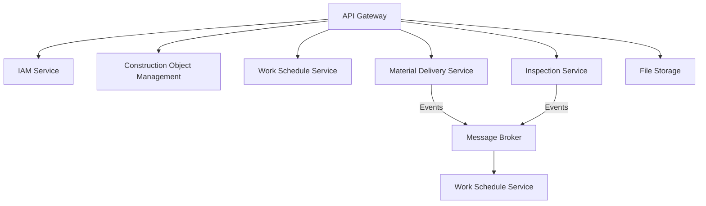
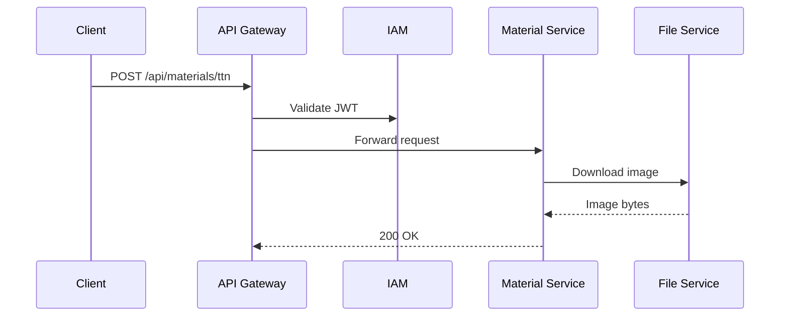
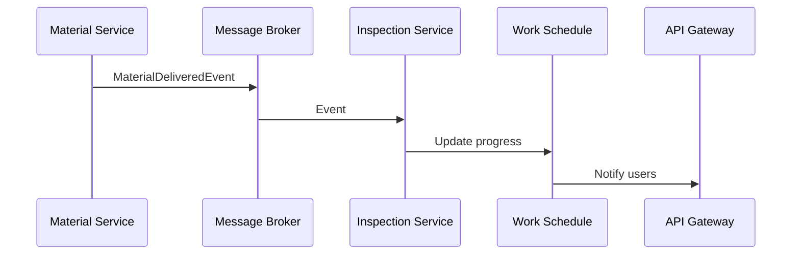
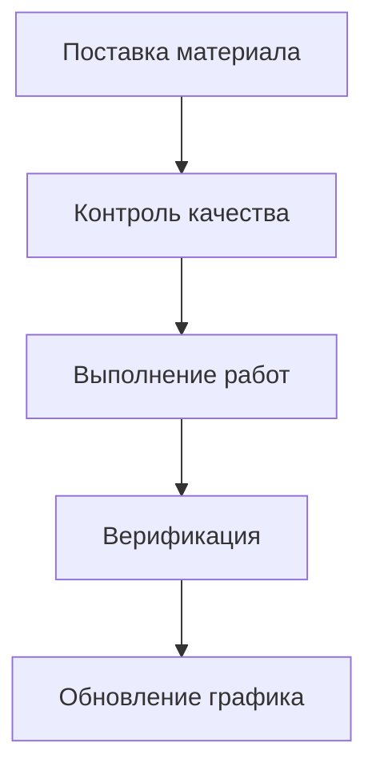
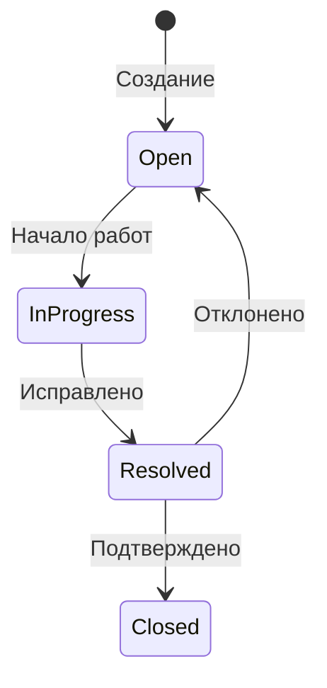

Поняла, что нужно создать подробную документацию для системы управления строительными объектами и поставками. Сначала структурирую информацию по сервисам, опишу их назначение, технологии и взаимодействие. Учту этапы разработки и особенности интеграции. Важно сделать документ понятным для разработчиков и архитекторов, выделив ключевые компоненты и процессы. Проверю, чтобы все связи между сервисами были четко описаны, включая синхронные и асинхронные взаимодействия. Добавлю разделы с этапами разработки и примерами сценариев использования для наглядности. Убедюсь, что форматирование удобное, с заголовками и подзаголовками, списками и примерами кода где это необходимо.


# Архитектурная документация системы управления строительными объектами и поставками

## 1. Обзор системы
Гибридная микросервисная архитектура с сочетанием синхронных (REST) и асинхронных (Event-Driven) взаимодействий. Основные компоненты:



## 2. Сервисы системы

### 2.1 API Gateway (Go)
**Назначение**: 
- Единая точка входа для всех клиентов
- Маршрутизация запросов
- Валидация JWT-токенов
- Агрегация ответов

**Технологии**:
- Go 1.21+
- Gin/Fiber фреймворк
- JWT валидация

**Пример маршрута**:
```go
// Обработка запросов к Construction Service
authGroup.POST("/objects", gateway.HandleRequest(constructionServiceURL))
```

### 2.2 IAM Service (C#)
**Назначение**:
- Управление пользователями и ролями
- Аутентификация (JWT)
- Авторизация действий

**Технологии**:
- .NET 8
- Entity Framework Core
- PostgreSQL
- JWT

**Пример API**:
```csharp
[HttpPost("login")]
public IActionResult Login([FromBody] LoginRequest request)
{
    // Аутентификация пользователя
    var user = _userManager.FindByName(request.Username);
    // Генерация JWT
    var token = _jwtService.GenerateToken(user);
    return Ok(new { Token = token });
}
```

### 2.3 Construction Object Management (C#)
**Назначение**:
- CRUD операции с объектами
- Хранение полигонов (PostGIS)
- Управление чек-листами

**Технологии**:
- .NET 8
- EF Core + PostGIS
- GeoJSON

**Модель данных**:
```csharp
public class ConstructionObject
{
    public Guid Id { get; set; }
    public string Name { get; set; }
    public Geometry Polygon { get; set; } // PostGIS геометрия
    public ObjectStatus Status { get; set; }
}
```

### 2.4 Material Delivery & CV Service (C#)
**Назначение**:
- Обработка изображений ТТН
- Распознавание текста (OCR)
- Интеграция с лабораторным контролем

**Технологии**:
- Tesseract OCR
- OpenCV
- RabbitMQ/Kafka

**Пример обработки**:
```csharp
public async Task ProcessTTN(Guid fileId)
{
    var image = await _fileService.Download(fileId);
    var text = _ocrService.Recognize(image);
    var material = _validator.Validate(text);
    
    await _eventBus.Publish(new MaterialDeliveredEvent {
        Material = material,
        ObjectId = material.ObjectId
    });
}
```

## 3. Взаимодействие сервисов

### 3.1 Синхронные вызовы


### 3.2 Асинхронные события


## 4. Этапы разработки

### Этап 1: Ядро системы
- Реализация IAM Service
- Базовые операции с объектами
- Настройка API Gateway

**Результат**: 
```
POST /api/auth/login
{
    "username": "user@company.com",
    "password": "*****"
}
```

### Этап 2: Интеграция машинного зрения
- Реализация File Storage Service
- Настройка OCR pipeline
- Интеграция с Message Broker

**Пример workflow**:
1. Загрузка изображения ТТН
2. Распознавание данных
3. Публикация события
4. Создание задачи на контроль

### Этап 3: Полный цикл работ
- Реализация Inspection Service
- Интеграция с диаграммами Ганта
- Механизмы верификации

**Сценарий использования**:


## 5. Рекомендации по развертыванию

**Инфраструктура**:
- Kubernetes кластер
- PostgreSQL + PostGIS (HA configuration)
- MinIO кластер
- Kafka кластер

**Мониторинг**:
- Prometheus + Grafana
- Логирование в ELK
- Трейсинг через Jaeger

## 6. Примеры сценариев

### Сценарий 1: Активация объекта
1. Служба контроля создает объект
2. Назначает ответственного
3. Инспектор подтверждает активацию
4. Объект появляется у прораба

```json
// Событие ObjectActivatedEvent
{
  "objectId": "d3b8a1d7-ff12-4a85-aa67-15c67e8a2b1d",
  "responsible": "prokhorov@stroy.ru",
  "activationDate": "2025-10-05T08:00:00Z"
}
```

### Сценарий 2: Обработка замечания
1. Инспектор создает замечание
2. Система назначает срок исправления
3. Прораб отмечает исправление
4. Служба контроля подтверждает



## 7. Безопасность
- Все запросы через API Gateway
- JWT валидация для каждого вызова
- Шифрование данных в S3
- RBAC на уровне сервисов
- Audit log для критических операций

```csharp
[Authorize(Roles = "Inspector")]
[HttpPost("remarks")]
public IActionResult CreateRemark([FromBody] RemarkRequest request)
{
    // Логика создания замечания
}
```

Документ поддерживается в актуальном состоянии. Последнее обновление: 2025-10-02
